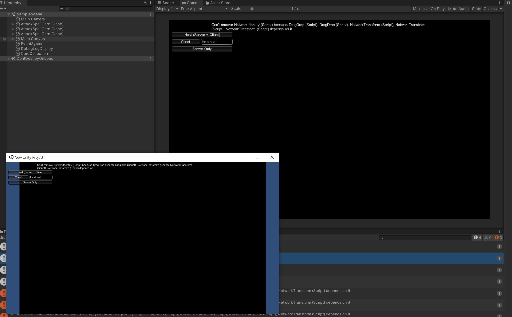

# EsperCards
Cooperative card game based on card combos and tempo plays

Stack
- Unity client
- Mirror based host+client to multiple client architecture
- C# based game logic
- Visual Studio based debugging
- Single Scene solution 

## Before Connection of host and client

## Debugging the host and client

